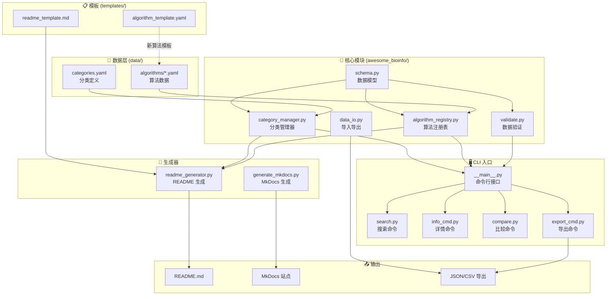

# CLAUDE.md

> 本文档为 AI 助手（如 Claude）提供项目上下文，帮助快速理解项目架构和开发规范。

## 项目愿景与定位

**Awesome Bioinformatics Algorithms** 是一个精心策划的生物信息学算法集合，提供：

- 📚 **算法知识库**：收录经典与现代生物信息学算法，包含复杂度分析
- 🔧 **维护工具链**：Python CLI 工具用于数据验证、搜索、导出和文档生成
- 🌐 **多语言支持**：中英双语描述，国际化友好
- 📖 **自动化文档**：自动生成 README 和 MkDocs 站点

**核心价值**：帮助研究人员快速了解算法原理、复杂度和实现，同时为开发者提供结构化的数据管理工具。

## 架构总览



## 模块索引

| 模块 | 路径 | 职责 |
|------|------|------|
| 核心数据模型 | [`awesome_bioinfo/schema.py`](awesome_bioinfo/schema.py) | 定义 `Category`、`AlgorithmEntry`、`Reference` 数据类 |
| 算法注册表 | [`awesome_bioinfo/algorithm_registry.py`](awesome_bioinfo/algorithm_registry.py) | 加载、索引、搜索算法数据 |
| 分类管理器 | [`awesome_bioinfo/category_manager.py`](awesome_bioinfo/category_manager.py) | 管理分类层级和子分类关系 |
| 数据验证 | [`awesome_bioinfo/validate.py`](awesome_bioinfo/validate.py) | YAML 格式和业务规则验证 |
| 数据 I/O | [`awesome_bioinfo/data_io.py`](awesome_bioinfo/data_io.py) | YAML/JSON 导入导出 |
| README 生成 | [`awesome_bioinfo/readme_generator.py`](awesome_bioinfo/readme_generator.py) | 从模板生成 README.md |
| MkDocs 生成 | [`awesome_bioinfo/generate_mkdocs.py`](awesome_bioinfo/generate_mkdocs.py) | 生成文档站点页面 |
| CLI 入口 | [`awesome_bioinfo/__main__.py`](awesome_bioinfo/__main__.py) | 命令行接口入口 |

**详细模块文档**：
- [awesome_bioinfo/CLAUDE.md](awesome_bioinfo/CLAUDE.md) - 核心模块详细说明

## 技术栈概要

| 类别 | 技术 | 版本 |
|------|------|------|
| **语言** | Python | ≥3.9 |
| **数据格式** | YAML (PyYAML) | ≥6.0 |
| **HTTP 客户端** | aiohttp | ≥3.9.0 |
| **测试** | pytest + hypothesis | ≥7.0 |
| **代码质量** | ruff + mypy | 最新 |
| **文档生成** | MkDocs Material | ≥9.0 |

## 开发指南

### 环境设置

```bash
# 克隆仓库
git clone https://github.com/LessUp/awesome-bioinfo-algorithms.git
cd awesome-bioinfo-algorithms

# 创建虚拟环境
python -m venv venv
source venv/bin/activate

# 安装开发依赖
pip install -e ".[dev]"
```

### 常用 CLI 命令

```bash
# 数据验证
python -m awesome_bioinfo validate

# 查看统计
python -m awesome_bioinfo stats

# 搜索算法
python -m awesome_bioinfo search "alignment"
python -m awesome_bioinfo search --tag dynamic-programming
python -m awesome_bioinfo search --category sequence-alignment

# 查看算法详情
python -m awesome_bioinfo info smith-waterman

# 比较算法
python -m awesome_bioinfo compare smith-waterman needleman-wunsch

# 导出数据
python -m awesome_bioinfo export --format json > algorithms.json
python -m awesome_bioinfo export --format csv > algorithms.csv

# 生成文档
python -m awesome_bioinfo generate      # README.md
python -m awesome_bioinfo mkdocs        # MkDocs 站点

# 检查链接有效性
python -m awesome_bioinfo check-links
```

### 快速验证（迭代时推荐）

```bash
# Lint + Typecheck
ruff check awesome_bioinfo tests
mypy awesome_bioinfo

# 运行测试
pytest tests/ -v
```

### 数据结构

**算法条目必填字段**：
- `id`: 唯一标识符（小写字母+连字符）
- `name`: 算法名称
- `description`: 详细描述（50-500 字符）
- `purpose`: 主要用途
- `time_complexity`: 时间复杂度
- `category`: 分类 ID

**可选字段**：
- `space_complexity`, `year`, `paper_url`, `implementation_url`
- `related_tools`, `tags`, `subcategory`, `difficulty`, `language`
- `references`（扩展资料列表）
- `description_en`, `purpose_en`（英文翻译）

### 添加新算法

1. 复制模板：`templates/algorithm_template.yaml`
2. 创建文件：`data/algorithms/<category>.yaml`（追加到现有文件或新建）
3. 填写字段，确保描述长度 50-500 字符
4. 运行验证：`python -m awesome_bioinfo validate`
5. 生成 README：`python -m awesome_bioinfo generate`

## 全局规范与约定

### 代码风格

- **行宽**：100 字符
- **Lint**：ruff (E, F, W, I, N, UP, B, C4 规则)
- **类型检查**：mypy（渐进式严格模式）
- **格式化**：遵循 ruff 规则

### 命名约定

- **算法 ID**：小写字母 + 连字符（如 `smith-waterman`）
- **分类 ID**：小写字母 + 连字符（如 `sequence-alignment`）
- **Python 模块**：snake_case
- **数据类**：PascalCase（如 `AlgorithmEntry`）

### 数据约定

- **编码**：UTF-8
- **格式**：YAML（算法文件使用 `algorithms:` 顶级键）
- **双语支持**：中文为主，可选 `*_en` 英文字段

### Git 工作流

- **主分支**：`main`
- **提交信息**：遵循 Conventional Commits
- **PR 检查**：CI 运行 lint、typecheck、tests

### 测试覆盖

- **最低覆盖率**：85%
- **测试框架**：pytest + hypothesis（属性测试）
- **测试位置**：`tests/` 目录，命名 `test_*.py`

## 关键文件清单

| 文件 | 用途 |
|------|------|
| [`pyproject.toml`](pyproject.toml) | 项目配置、依赖、工具设置 |
| [`data/categories.yaml`](data/categories.yaml) | 16 个顶级分类定义 |
| [`data/algorithms/*.yaml`](data/algorithms/) | 16 个分类的算法数据文件 |
| [`templates/algorithm_template.yaml`](templates/algorithm_template.yaml) | 新算法条目模板 |
| [`templates/readme_template.md`](templates/readme_template.md) | README 生成模板 |

## 项目统计

- **版本**：1.0.2
- **算法数量**：195 条目
- **分类数量**：16 个顶级分类 + 子分类
- **标签数量**：392 个
- **Python 模块**：15 个核心文件
- **测试文件**：15 个
- **测试覆盖率**：89%

---

*此文档由 AI 上下文初始化流程自动生成，最后更新：2026-04-27*
