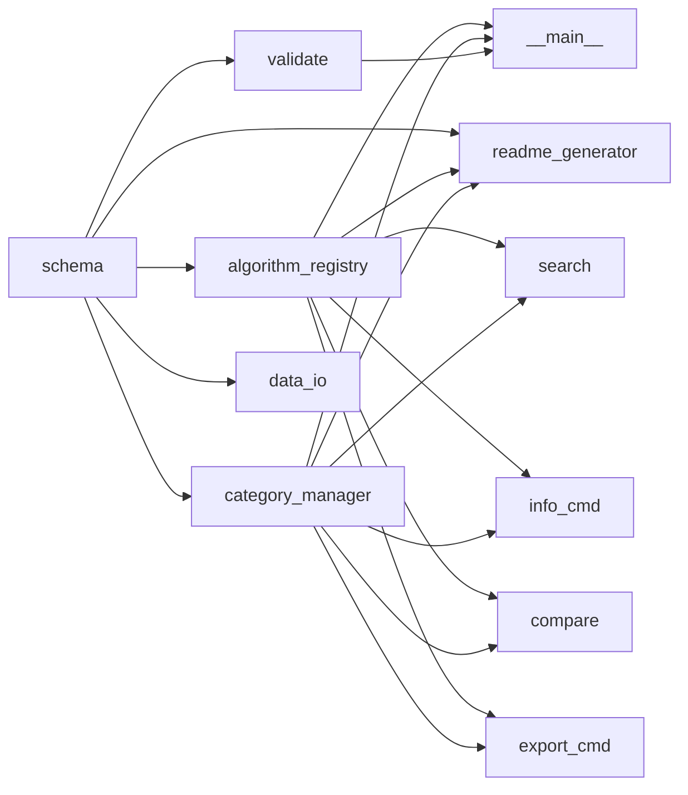

# awesome_bioinfo 模块

> [← 返回项目根目录](../CLAUDE.md)

## 模块职责与边界

`awesome_bioinfo` 是项目的核心 Python 包，提供：

- **数据模型定义**：结构化的算法和分类数据类
- **数据管理**：加载、索引、搜索算法数据
- **验证逻辑**：YAML 格式和业务规则验证
- **文档生成**：README 和 MkDocs 站点生成
- **CLI 工具**：命令行接口用于日常维护

**边界**：
- ✅ 数据处理、验证、生成
- ✅ 命令行工具
- ❌ Web 服务（非本项目目标）
- ❌ 算法实现（仅收录元数据）

## 模块结构

```
awesome_bioinfo/
├── __init__.py              # 包入口，导出主要模块
├── __main__.py              # CLI 入口点
├── schema.py                # 数据模型定义
├── algorithm_registry.py    # 算法注册表
├── category_manager.py      # 分类管理器
├── validate.py              # 数据验证器
├── data_io.py               # 数据导入导出
├── readme_generator.py      # README 生成器
├── generate_mkdocs.py       # MkDocs 生成器
├── generate_readme.py       # 兼容包装脚本
├── search.py                # 搜索命令
├── info_cmd.py              # 详情命令
├── compare.py               # 比较命令
├── export_cmd.py            # 导出命令
├── link_checker.py          # 链接检查器
├── readme_generator.py      # README 生成（重复，待清理）
└── py.typed                 # PEP 561 类型标记
```

## 核心组件

### 1. 数据模型 (schema.py)

```python
# 主要数据类
class Category:
    id: str
    name: str              # 中文名
    name_en: str           # 英文名
    description: str
    subcategories: list[Category]
    parent_id: str | None

class AlgorithmEntry:
    # 必填字段
    id: str
    name: str
    description: str       # 50-500 字符
    purpose: str
    time_complexity: str
    category: str
    
    # 可选字段
    space_complexity: str
    year: int
    paper_url: str
    implementation_url: str
    related_tools: list[str]
    tags: list[str]
    subcategory: str
    difficulty: str        # beginner/intermediate/advanced
    language: list[str]
    references: list[Reference]
    description_en: str
    purpose_en: str

class Reference:
    url: str
    title: str
    type: str              # tutorial/blog/video/book/documentation/slides
```

**常量定义**：
- `VALID_DIFFICULTIES`: ("beginner", "intermediate", "advanced")
- `VALID_REFERENCE_TYPES`: ("tutorial", "blog", "video", "book", "documentation", "slides")

### 2. 算法注册表 (algorithm_registry.py)

```python
class AlgorithmRegistry:
    """管理所有算法条目的加载、索引和搜索"""
    
    def load_all() -> list[AlgorithmEntry]
    def get_by_category(category_id) -> list[AlgorithmEntry]
    def get_by_tag(tag) -> list[AlgorithmEntry]
    def get_by_subcategory(subcategory_id) -> list[AlgorithmEntry]
    def search(keyword) -> list[AlgorithmEntry]
    def get_algorithm(algo_id) -> AlgorithmEntry | None
    def get_statistics() -> RegistryStats
```

**索引结构**：
- `_by_category`: 按 category ID 分组
- `_by_subcategory`: 按 subcategory ID 分组
- `_by_tag`: 按 tag 分组
- `_by_id`: 按 algorithm ID 索引

### 3. 分类管理器 (category_manager.py)

```python
class CategoryManager:
    """管理分类层级和查询"""
    
    def load_categories(path) -> list[Category]
    def get_category(category_id) -> Category | None
    def list_all_categories() -> list[Category]
    def get_subcategories(category_id) -> list[Category]
    def get_parent_category(category_id) -> Category | None
    def category_exists(category_id) -> bool
```

### 4. 数据验证器 (validate.py)

```python
class Validator:
    """验证算法和分类数据"""
    
    def validate_algorithm(data) -> ValidationResult
    def validate_category(data) -> ValidationResult
    def validate_algorithms_file(file_path) -> ValidationResult
    def validate_categories_file(file_path) -> ValidationResult
    def validate_all(data_dir) -> ValidationResult
```

**验证规则**：
- 必填字段检查
- 描述长度：50-500 字符
- 分类/子分类 ID 有效性
- 子分类与父分类关系
- URL 格式验证
- 重复 ID 检测

### 5. README 生成器 (readme_generator.py)

```python
class ReadmeGenerator:
    """从模板生成 README.md"""
    
    def generate() -> str
    def generate_toc() -> str
    def generate_algorithm_entry(algo) -> str
    def save(output_path)
```

**模板变量**：
- `{{ total_algorithms }}`
- `{{ total_categories }}`
- `{{ total_tags }}`
- `{{ toc }}`
- `{{ category_overview }}`
- `{{ featured_content }}`

## CLI 命令

```bash
python -m awesome_bioinfo <command> [options]
```

| 命令 | 功能 | 选项 |
|------|------|------|
| `validate` | 验证所有数据文件 | - |
| `stats` | 显示统计信息 | - |
| `generate` | 生成 README.md | `--output <path>` |
| `search` | 搜索算法 | `--keyword`, `--tag`, `--category`, `--difficulty` |
| `info <id>` | 查看算法详情 | - |
| `compare <id1> <id2>` | 比较两个算法 | - |
| `export` | 导出数据 | `--format json/csv`, `--output <file>` |
| `mkdocs` | 生成 MkDocs 站点 | - |
| `check-links` | 检查 URL 有效性 | - |

## 依赖关系



## 测试策略

**测试文件位置**：`../tests/`

| 测试文件 | 覆盖模块 |
|----------|----------|
| `test_schema.py` | schema.py 数据类 |
| `test_algorithm_registry.py` | algorithm_registry.py |
| `test_category_manager.py` | category_manager.py |
| `test_validate.py` | validate.py |
| `test_data_io.py` | data_io.py |
| `test_readme_generator.py` | readme_generator.py |
| `test_cli.py` | CLI 集成测试 |
| `test_search.py` | 搜索功能 |
| `test_info_cmd.py` | info 命令 |
| `test_export_cmd.py` | 导出功能 |
| `test_command_features.py` | 命令特性 |
| `test_data_completeness.py` | 数据完整性 |
| `test_generate_readme.py` | README 生成 |

**运行测试**：
```bash
# 快速验证
pytest tests/ -v

# 带覆盖率
pytest tests/ --cov=awesome_bioinfo --cov-report=html
```

## 入口文件

- **包入口**：`__init__.py` - 导出主要模块和版本信息
- **CLI 入口**：`__main__.py` - 命令行接口，支持 `python -m awesome_bioinfo`

## 关键文件列表

| 文件 | 行数 | 职责 |
|------|------|------|
| `schema.py` | ~207 | 数据模型定义 |
| `validate.py` | ~532 | 数据验证逻辑 |
| `algorithm_registry.py` | ~212 | 算法加载和索引 |
| `readme_generator.py` | ~346 | README 生成 |
| `__main__.py` | ~341 | CLI 入口和命令分发 |
| `data_io.py` | ~221 | 数据导入导出 |
| `category_manager.py` | ~130 | 分类管理 |

---

*此文档由 AI 上下文初始化流程生成，最后更新：2026-04-24*
