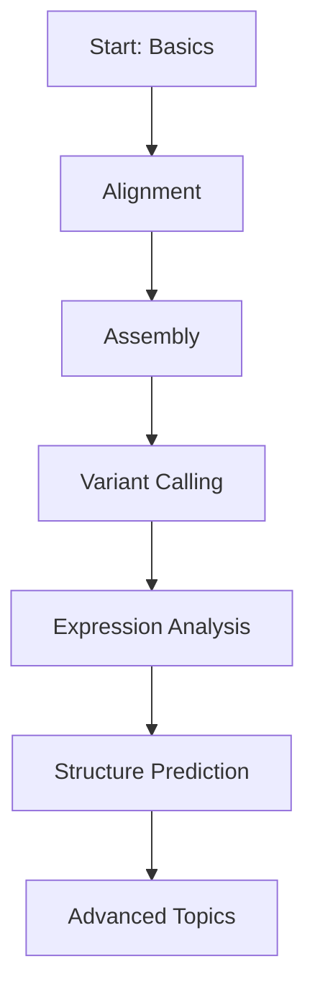

# Algorithm Academy

Welcome to the **Awesome Bioinformatics Algorithms Academy**. Here you'll find systematic learning resources for bioinformatics algorithms, from basic concepts to cutting-edge methods, helping you build a complete knowledge framework.

## Academy Features

::: info Academic Rigor
Each algorithm cites original papers, providing theoretical foundations and mathematical derivations.
:::

::: tip Engineering Practice
Combine real datasets and code examples, emphasizing practical application skills.
:::

::: warning Continuous Updates
Keep pace with field developments, timely including latest algorithms and breakthrough methods.
:::

## Learning Modules

### 📚 [Learning Path](/en/academy/learning-path)

Systematic learning guide from beginner to expert, including four stages:

1. **Beginner** — Basic concepts and classic algorithms
2. **Intermediate** — Alignment, assembly, variant calling
3. **Advanced** — Structure prediction, single-cell, metagenomics
4. **Expert** — Deep learning, graph genomics, spatial omics

### 🧬 Algorithm Categories

| Category | Algorithms | Core Content |
|----------|------------|--------------|
| [Sequence Alignment](/en/categories/sequence-alignment/) | 19 | Needleman-Wunsch, BWT, WFA |
| [Assembly](/en/categories/assembly/) | 14 | De Bruijn, OLC, Hybrid |
| [Variant Calling](/en/categories/variant-calling/) | 14 | GATK, DeepVariant, Sniffles |
| [Protein Structure](/en/categories/protein-structure/) | 14 | AlphaFold, RoseTTAFold |
| [Single-Cell](/en/categories/single-cell/) | 15 | Scanpy, Seurat, scVI |

## Recommended Learning Order

## Quick Access

### 🎯 Beginner
[Learning Path](/en/academy/learning-path) · [Basic Algorithms](/en/algorithms/needleman-wunsch)

### 🔬 Intermediate
[References](/en/research/references) · [Evolution Notes](/en/research/evolution)

### 📖 Advanced
[Algorithm Atlas](/en/algorithms/) · [Categories](/en/categories/)

---

[Start Learning →](/en/academy/learning-path)