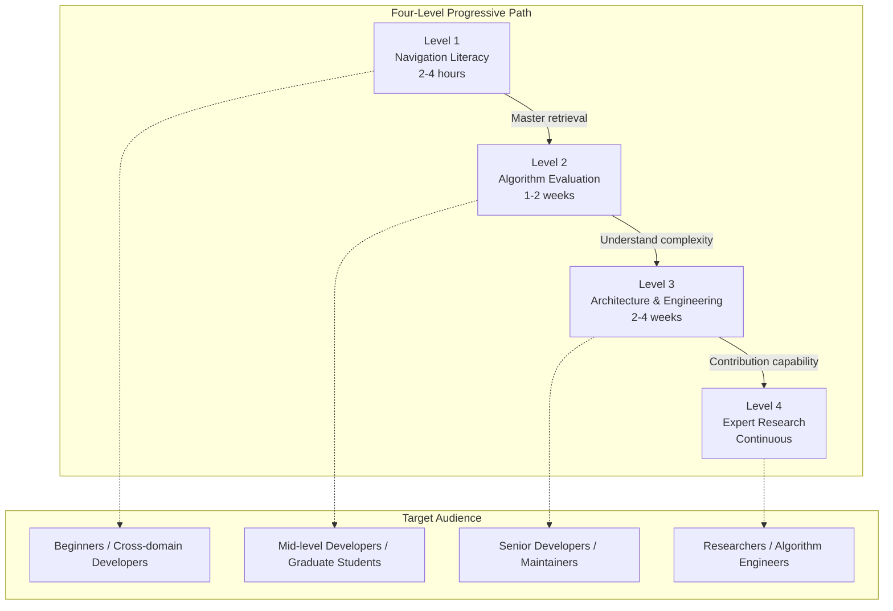
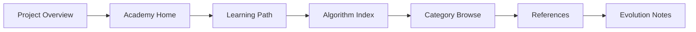

# Algorithm Academy

## Overview

Welcome to the Bioinformatics Algorithm Academy. This academy provides a systematic knowledge framework for learners of diverse backgrounds, covering core domains from foundational concepts to frontier research in sequence analysis, genomics, protein structure prediction, and beyond.

## Learning Path Overview

## Core Domains

| Domain | Algorithms | Representative Algorithms | Difficulty |
|--------|------------|---------------------------|------------|
| Sequence Alignment | 30+ | Smith-Waterman, BLAST, BWA | Intermediate |
| Sequence Assembly | 20+ | Velvet, SPAdes, Canu | Advanced |
| Variant Calling | 25+ | GATK, Strelka2, DeepVariant | Advanced |
| Protein Structure Prediction | 15+ | AlphaFold, RoseTTAFold, ESMFold | Expert |
| Single-Cell Analysis | 20+ | Seurat, SCANPY, Monocle | Intermediate |
| Metagenomics | 15+ | Kraken, MetaPhlAn, MEGAN | Intermediate |

## Recommended Learning Sequence

## Quick Access

- **[Learning Path](/en/academy/learning-path)** — Four-level progressive curriculum and required reading
- **[Algorithm Index](/en/algorithms/)** — Complete index of 195+ algorithm entries
- **[Category Navigation](/en/categories/)** — Browse 16 top-level categories
- **[References](/en/research/references)** — Classic papers and must-read reviews

## Learning Recommendations

### Beginners

Start with **Level 1: Navigation Literacy**, spending 2-4 hours to establish a panoramic understanding of bioinformatics algorithms. Focus on mastering the category taxonomy, tag network, and retrieval functions.

### Intermediate Developers

Complete **Level 2: Algorithm Evaluation**, learning to evaluate algorithms from multiple dimensions and make selection decisions. Focus on understanding the engineering implications of time/space complexity on real-world big data.

### Senior Developers

Challenge **Level 3: Architecture and Engineering**, gaining deep understanding of data sources, generators, VitePress publishing pipeline, and CLI workflow, with the ability to independently extend the knowledge base.

### Researchers

Enter **Level 4: Expert Research**, tracking frontier algorithms (2022-2025), with capabilities in paper reproduction, performance benchmarking, and community contribution.
