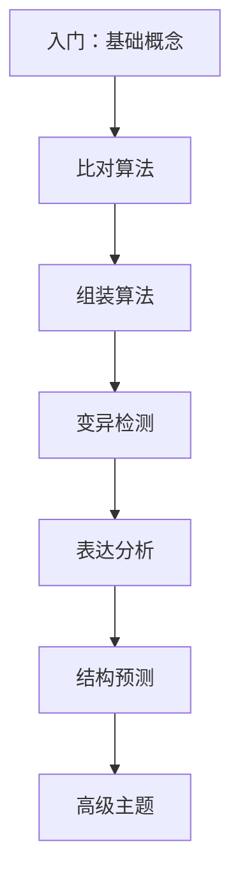

# 算法学院

欢迎来到 **Awesome Bioinformatics Algorithms 学院**。这里提供系统化的生物信息学算法学习资源，从基础概念到前沿方法，帮助你建立完整的知识体系。

## 学院特色

::: info 学术严谨
每个算法都引用原始论文，提供理论基础和数学推导。
:::

::: tip 工程实践
结合真实数据集和代码示例，强调实际应用能力。
:::

::: warning 持续更新
紧跟领域发展，及时收录最新算法和突破性方法。
:::

## 学习模块

### 📚 [学习路径](/zh/academy/learning-path)

从入门到专家的系统化学习指南，包含四个阶段：

1. **入门阶段** — 基础概念与经典算法
2. **进阶阶段** — 比对、组装、变异检测
3. **高级阶段** — 结构预测、单细胞、宏基因组
4. **专家阶段** — 深度学习、图基因组、空间组学

### 🧬 算法分类

| 分类 | 算法数 | 核心内容 |
|------|--------|----------|
| [序列比对](/zh/categories/sequence-alignment/) | 19 | Needleman-Wunsch, BWT, WFA |
| [序列组装](/zh/categories/assembly/) | 14 | De Bruijn, OLC, 混合组装 |
| [变异检测](/zh/categories/variant-calling/) | 14 | GATK, DeepVariant, Sniffles |
| [蛋白质结构](/zh/categories/protein-structure/) | 14 | AlphaFold, RoseTTAFold |
| [单细胞](/zh/categories/single-cell/) | 15 | Scanpy, Seurat, scVI |

## 推荐学习顺序

## 快速入口

### 🎯 新手入门
[学习路径](/zh/academy/learning-path) · [基础算法](/zh/algorithms/needleman-wunsch)

### 🔬 进阶研究
[参考文献](/zh/research/references) · [演进思考](/zh/research/evolution)

### 📖 深度学习
[算法图谱](/zh/algorithms/) · [分类导航](/zh/categories/)

---

[开始学习 →](/zh/academy/learning-path)
