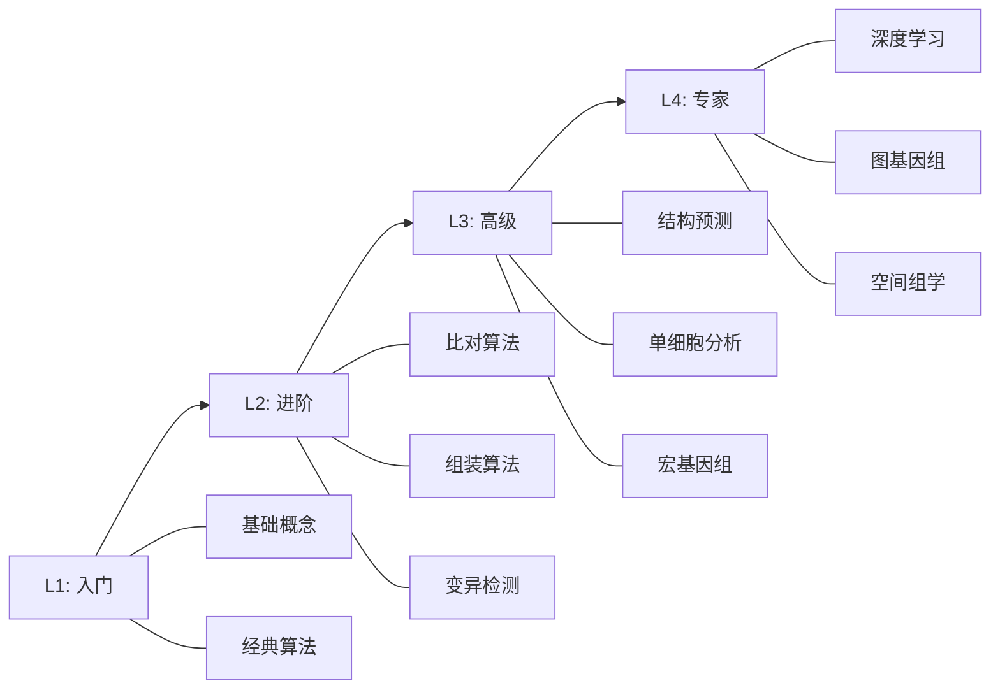
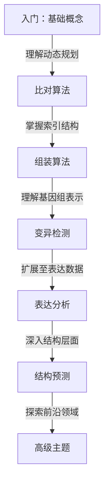

# 算法学院

欢迎来到 **Awesome Bioinformatics Algorithms 学院**——一个系统化的生物信息学算法学习平台。这里汇聚了 195+ 算法的核心原理、复杂度分析与学术引用，帮助你建立完整的知识体系。

## 学院特色

::: info 学术严谨
每个算法都引用原始论文，提供理论基础和数学推导，确保知识可追溯。
:::

::: tip 工程实践
结合真实数据集和代码示例，强调从理论到实践的完整路径。
:::

::: warning 持续演进
紧跟领域发展，及时收录最新算法和突破性方法，保持知识前沿性。
:::

## 学习路径概览

从入门到专家的系统化学习指南：

## 核心领域

| 领域 | 算法数 | 代表性算法 | 难度 |
|------|--------|-----------|------|
| [序列比对](/zh/categories/sequence-alignment/) | 19 | Needleman-Wunsch, BWT, WFA | ★★☆ |
| [序列组装](/zh/categories/assembly/) | 14 | De Bruijn, OLC, 混合组装 | ★★★ |
| [变异检测](/zh/categories/variant-calling/) | 14 | GATK, DeepVariant, Sniffles | ★★★ |
| [蛋白质结构](/zh/categories/protein-structure/) | 14 | AlphaFold, RoseTTAFold | ★★★★ |
| [单细胞分析](/zh/categories/single-cell/) | 15 | Scanpy, Seurat, scVI | ★★★ |
| [宏基因组](/zh/categories/metagenomics/) | 14 | MetaPhlAn, HUMAnN | ★★★ |

## 推荐学习顺序

## 快速入口

  <a href="learning-path" class="aba-wp-card">
    01
    

      <strong>学习路径</strong>
      
四级渐进式课程，从入门到专家的系统化路线图

    

  </a>
  <a href="../algorithms/" class="aba-wp-card">
    02
    

      <strong>算法图谱</strong>
      
195+ 算法的完整索引，支持按领域、标签、复杂度筛选

    

  </a>
  <a href="../research/references" class="aba-wp-card">
    03
    

      <strong>参考文献</strong>
      
按领域分类的经典论文、必读综述与相关项目

    

  </a>

---

[开始学习 →](/zh/academy/learning-path)
