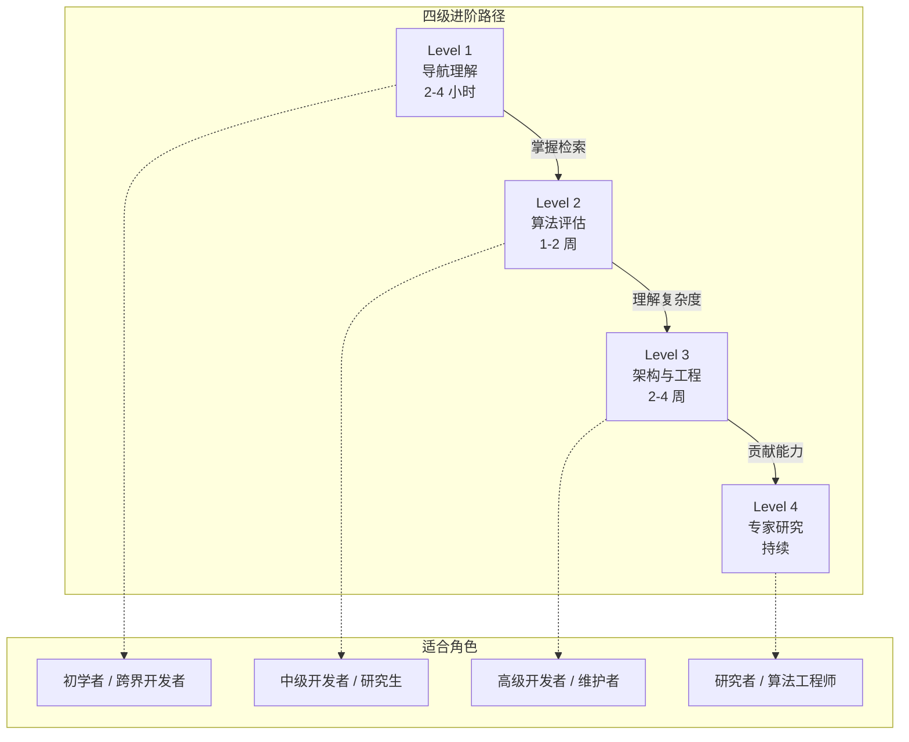
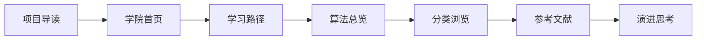

# 算法学院

## 概述

欢迎来到生物信息学算法学院。本学院为不同背景的学习者提供系统化的算法知识体系，从基础概念到前沿研究，覆盖序列分析、基因组学、蛋白质结构预测等核心领域。

## 学习路径概览

## 核心领域

| 领域 | 算法数 | 代表算法 | 学习难度 |
|------|--------|----------|----------|
| 序列比对 | 30+ | Smith-Waterman, BLAST, BWA | 中级 |
| 序列组装 | 20+ | Velvet, SPAdes, Canu | 高级 |
| 变异检测 | 25+ | GATK, Strelka2, DeepVariant | 高级 |
| 蛋白质结构预测 | 15+ | AlphaFold, RoseTTAFold, ESMFold | 专家 |
| 单细胞分析 | 20+ | Seurat, SCANPY, Monocle | 中级 |
| 宏基因组学 | 15+ | Kraken, MetaPhlAn, MEGAN | 中级 |

## 推荐学习顺序

## 快速入口

- **[学习路径](/zh/academy/learning-path)** — 四级进阶课程体系与必读文献
- **[算法总览](/zh/algorithms/)** — 195+ 算法条目完整索引
- **[分类导航](/zh/categories/)** — 16 大顶级分类浏览
- **[参考文献](/zh/research/references)** — 经典论文与必读综述

## 学习建议

### 初学者

建议从 **Level 1: 导航理解** 开始，用 2-4 小时建立对生物信息学算法全景的认知。重点掌握分类体系、标签网络和检索功能。

### 中级开发者

建议完成 **Level 2: 算法评估**，学习从多维度评估算法并做出选型决策。重点理解时间/空间复杂度在真实大数据上的工程含义。

### 高级开发者

建议挑战 **Level 3: 架构与工程**，深入理解数据源、生成器、VitePress 发布链路以及 CLI 工作流，具备独立扩展知识库的能力。

### 研究者

建议进入 **Level 4: 专家研究**，追踪前沿算法（2022-2025），具备论文复现、性能基准测试与社区贡献的能力。
